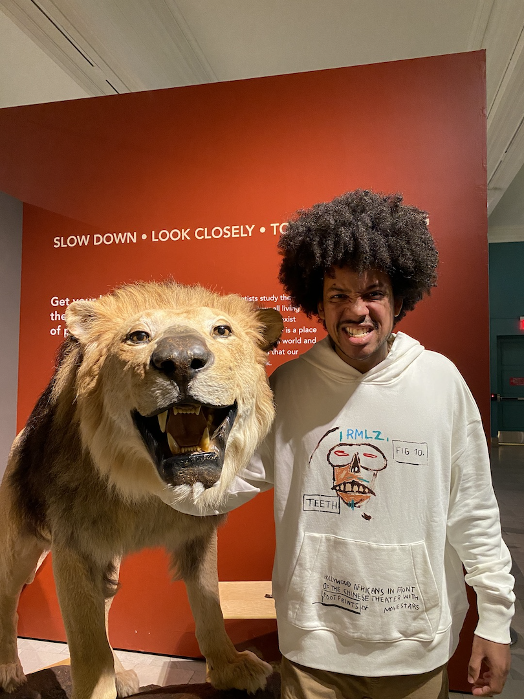
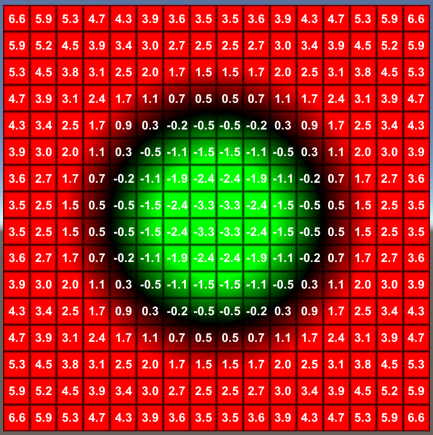

<!-- _class: invert -->
# Multiresolution Representation of Images   using Neural Networks

#### Understanding Deep Learning 2024 - ICMC, USP

## Hallison Paz

### October 15th, 2024

<!-- _footer: Presentation recorded and [available on Youtube](https://www.youtube.com/live/WmaWecH0ThU?si=cWvOgvNIpkO9_0zl) -->

<!-- _paginate: false -->
---

# Hallison Paz

- AI Graphics Researcher
- PhD Candidate 
@IMPA, @Visgraf

- Alma Mater: 
Instituto Militar de Engenharia

- Co-founder
@Programação Dinâmica

---
<!-- _class: invert -->

---
# Codec Avatars

- Research Scientist Intern at Reality Labs Research (Meta). Pittsbugh, PA, USA.

<!-- _footer: Lex Fridman [podcast using avatars](https://youtu.be/MVYrJJNdrEg?si=yG_Hhx1JsBrBXHNa) -->

----
###### What do you mean by?
# Multiresolution representation of images

<video width="1200" height="800" controls>
  <source src="img/multiresolution-masp.mp4" type="video/mp4">
</video>

<!-- _class: inver -->

----
# Representational Networks

> You put water into a cup,  it becomes the cup
 – **Bruce Lee**

<!-- _footer: Apurba Kanti Roy, [CC BY-SA 4.0](https://creativecommons.org/licenses/by-sa/4.0), via Wikimedia Commons -->

<!-- _footer: check more details [at this video](https://www.youtube.com/live/voVBM6BYs8k?si=lgOZT6BRh9eL8fz3). -->
---

# Representational Networks

- Continuous function
* Compact
* New methods/operations

<!-- _footer: Image: training of a ReLu MLP to fit a cosine wave -->

---

<!-- _footer: Source: https://youtu.be/Wo0QVVM5jXE?si=9uxYNqsLNk0jAr8X -->

---
# Implicit Models

---

# Deep SDF

----
# Neural Radiance Fields (NeRFs)

<video width="1200" height="800" controls>
  <source src="img/nerf-example.mp4" type="video/mp4">
</video>

----

# Let's fit an MLP to it!

----

----

<!-- _footer: Check [paper website](https://bmild.github.io/fourfeat/) -->

----

# Looks better! 

----

<!-- _footer: Check [paper website](https://www.vincentsitzmann.com/siren/) -->

----

# Now, we are talking!

----

<!-- _class: invert -->

# Demo

### [Training a representational network for images](https://github.com/hallpaz/nov23google/blob/main/code/representational_networks.ipynb)

<table>
  <tr>
    <td> </td>
    <td></td>
    <td></td>
   </tr> 
</table>

---

# What about the multiresolution?

<!-- _class: invert -->
<!-- _paginate: false -->

----

----

# Isolating frequencies

<!-- _class: invert -->
<!-- _paginate: false -->

----

# Shallow Network - low frequencies

----

# Shallow Network - high frequencies

----

# 1 Hidden Layer - low frequencies

<!-- _paginate: false -->

----

# 1 Hidden Layer - high frequencies

<!-- _paginate: false -->

---

# What can we do with this information?

<!-- _class: invert -->
<!-- _paginate: false -->

---

# Multiscale Decomposition

- Let $\mathscr{f}:\mathcal{D}\to \mathcal{C}$ be a *ground-truth signal*

- We decompose it into a sum of $N$ stages: 

$$\mathscr{f}=\mathscr{g}_0 + \dots + \mathscr{g}_{N-1}$$
, 
<!-- where $\gt{g}_0$ captures the coarsest approximation of the signal and $\gt{g}_i$, for $i>0$, progressively introduces higher-frequency components.  -->
- $\mathscr{g}_0$ representes the coarse features

---

# Multiscale decomposition

The *level of detail* at stage $i$ is defined as:

$$
\mathscr{f}_i = \mathscr{g}_0 + \cdots + \mathscr{g}_i \quad \text{or} \quad \mathscr{f}_i = \mathscr{f} - \sum_{j=i+1}^{N-1} \mathscr{g}_j.
$$

Each stage $\mathscr{g}_i$ is computed as:
$$
\mathscr{g}_i = \mathscr{f}_{i+1} - K * \mathscr{f}_{i+1}, \quad \text{where } \mathscr{f}_{N-1} = \mathscr{f}.
$$

---

Exemplo - imagem filtrada e subtraida

<!-- _backgroundColor: #000000-->

<!-- _class: invert -->

---

## Multiresolution [Sinusoidal] Neural Networks (MR-Net)

 

$$f:\mathcal{D} \times [0,N] \to \mathcal{C}$$
 

$$f(x,t) = c_0(t) g_0(x) + \cdots + c_{N-1}(t) g_{N-1}(x),
$$

---

# Shallow Network (S-Net)

---

# Laplacian Network (L-Net)

---

# Modulated Network (M-Net)

---

# Multiresolution image representation

---

# Texture magnification / minification

---

# Continuous Scale

<!--  -->

<video width="1102" height="600" controls>
  <source src="img/continuous_scale.mov" type="video/mp4">
</video>

---

# Anti-aliasing

---

<!-- _class: invert -->

# Demo

### [Training a MR-Net for images](https://github.com/hallpaz/nov23google/blob/main/code/representational_networks.ipynb)

<!-- <table>
  <tr>
    <td> </td>
    <td></td>
    <td></td>
   </tr> 
</table> -->

---

# There's more to it...

<!-- _footer: To know about follow-up work on material textures, please check [this Youtube video](https://www.youtube.com/live/voVBM6BYs8k?si=Zxj4gtWJe893uzuV&t=4225) or [this Siggraph Poster](). --> 

---
# Thank you!

#### Reach out:

- hallpaz@impa.br
- [@pgdinamica](https://youtube.com/@pgdinamica) on Youtube
- @hallpaz at social media

<!-- _class: invert -->

----

# References:

- NeRF: Representing Scenes as Neural Radiance Fields for View Synthesis. [Website](https://www.matthewtancik.com/nerf).
- Occupancy Networks - Learning 3D Reconstruction in Function Space. [Website](https://github.com/autonomousvision/occupancy_networks).
- DeepSDF: Learning Continuous Signed Distance Functions for Shape Representation. [Github](https://github.com/facebookresearch/DeepSDF).
- Implicit Neural Representations with Periodic Activation Functions. [Website](https://www.vincentsitzmann.com/siren/).
- AI Graphics Theory and Practice. [IMPA Course](https://lvelho.impa.br/i3d23/).
- The making of MR-Net and a vision for multiresolution media representation. [Visgraf Seminar](https://www.youtube.com/live/voVBM6BYs8k?si=lgOZT6BRh9eL8fz3).

---

# References

- On the spectral bias of neural networks
N Rahaman*, A Baratin*, D Arpit, F Draxler, M Lin, F Hamprecht, Y Bengio, ...
International Conference on Machine Learning, 5301-5310